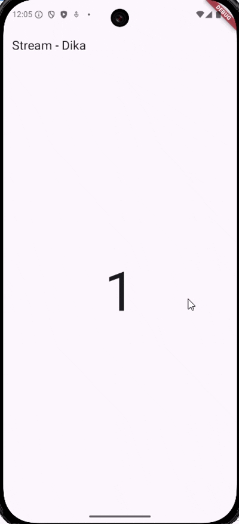

# streambuilder_dika

## Praktikum 5
### Soal 12
- langkah 3 membuat method getNumbers() untuk menghasilkan angka random dari 0 - 9 tiap 1 detik
- langkah 7 StreamBuilder mendengarkan stream numberStream dan menampilkan data terbaru ke UI setiap kali stream mengirim data
